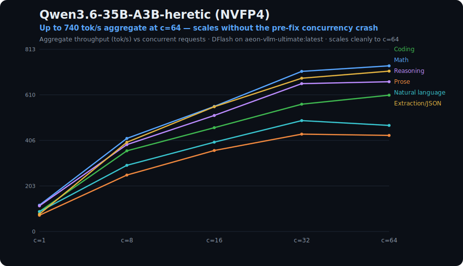

# Qwen3.6-35B-A3B-heretic NVFP4 + DFlash on DGX Spark

[](https://github.com/AEON-7/vllm-ultimate-dgx-spark/pkgs/container/aeon-vllm-ultimate)
[](https://huggingface.co/AEON-7/Qwen3.6-35B-A3B-heretic-NVFP4)
[](https://huggingface.co/z-lab/Qwen3.6-35B-A3B-DFlash)
[](LICENSE)
[](https://github.com/AEON-7/AEON-7#-support-the-work)

A production-stable deployment of **[`AEON-7/Qwen3.6-35B-A3B-heretic-NVFP4`](https://huggingface.co/AEON-7/Qwen3.6-35B-A3B-heretic-NVFP4)** with **[DFlash](https://github.com/z-lab/dflash)** speculative decoding on **NVIDIA DGX Spark** (GB10 / sm_121a).

> ⚠️ **READ THE REQUIREMENTS SECTION FIRST.** This image and its weights are tuned specifically for the DGX Spark (GB10 / sm_120-121 Blackwell). It will NOT work on Hopper, Ampere, B200, or other Blackwell variants without rebuilding.

| | |
|---|---|
| **Model** | `AEON-7/Qwen3.6-35B-A3B-heretic-NVFP4` (~22 GB, multimodal — **image input working** as of the 2026-06-18 vision fix) |
| **Drafter** | `z-lab/Qwen3.6-35B-A3B-DFlash` (~905 MB, public anonymous pull) |
| **Hardware** | DGX Spark (NVIDIA GB10, 128 GB unified memory, sm_121a) |
| **Image** | `ghcr.io/aeon-7/aeon-vllm-ultimate:latest` (= `:2026-06-18-v0.23.0-dflashfix`; rollback `:2026-06-11-pr41703`) |

---

## Quickstart (copy-paste)

Complete recipe — pull the container, the NVFP4 weights, and a **fresh** DFlash drafter, then serve with the vetted DGX-Spark flags. (No `--mamba-block-size` for this 35B-A3B drafter — it is all-full-attention.) Run on a DGX Spark (GB10 / sm_121a); see [Hard Requirements](#️-hard-requirements-read-first) first.

```bash
# 1. Pull the unified vLLM container (anonymous pull)
docker pull ghcr.io/aeon-7/aeon-vllm-ultimate:latest

# 2. Pull the NVFP4 model weights (this repo's weights)
huggingface-cli download AEON-7/Qwen3.6-35B-A3B-heretic-NVFP4 --local-dir ./aeon-model

# 3. Pull the DFlash drafter — FRESH (re-pull if cloned before 2026-04-19)
huggingface-cli download z-lab/Qwen3.6-35B-A3B-DFlash --local-dir ./aeon-drafter

# 4. Serve (ENTRYPOINT is /bin/bash, so pass --entrypoint vllm then serve ...)
docker run --gpus all --rm -p 8000:8000 \
  -v ./aeon-model:/model:ro \
  -v ./aeon-drafter:/drafter:ro \
  --entrypoint vllm \
  ghcr.io/aeon-7/aeon-vllm-ultimate:latest serve /model \
  --served-model-name qwen36-35b-heretic qwen36-fast qwen36-deep \
  --host 0.0.0.0 --port 8000 \
  --quantization compressed-tensors \
  --max-model-len 262144 \
  --max-num-seqs 64 \
  --max-num-batched-tokens 65536 \
  --gpu-memory-utilization 0.70 \
  --enable-chunked-prefill \
  --enable-prefix-caching \
  --trust-remote-code \
  --enable-auto-tool-choice --tool-call-parser qwen3_coder \
  --reasoning-parser qwen3 \
  --attention-backend flash_attn \
  --speculative-config '{"method":"dflash","model":"/drafter","num_speculative_tokens":11}'
```

For a docker-compose deployment, the 3-alias setup, and per-flag rationale, see [Deployment (compose + full recipe)](#deployment-compose--full-recipe) below.

---

## Headline performance (measured)

### v0.23.0 build — current production image

Measured on the current production image **`ghcr.io/aeon-7/aeon-vllm-ultimate:latest`** (vLLM 0.23.0 + AEON sm_121a build + DFlash `num_speculative_tokens: 11`), single-stream (c=1), by category. Mixed-domain prompt set, `enable_thinking=false` for clean decode-rate measurement:

| Category | 🟢 Decode tok/s | TTFT p50 | TPOT p50 | Prefill (PP) | DFlash accept |
|---|---:|---:|---:|---:|---:|
| Coding | **91.7** | 88 ms | 10.9 ms | 509 tok/s | 33% |
| Math | **123.6** | 113 ms | 8.1 ms | 494 tok/s | 48% |
| Reasoning | **120.6** | 120 ms | 8.3 ms | 359 tok/s | 46% |
| Prose | **75.2** | 137 ms | 13.3 ms | 234 tok/s | 24% |
| Natural language | **91.8** | 104 ms | 10.9 ms | 326 tok/s | 32% |
| Extraction / JSON | **79.8** | 103 ms | 12.5 ms | 468 tok/s | 28% |

Single-stream decode averages **~97 tok/s** across the six categories (min 75 on open-ended Prose, max 124 on Math/Reasoning where DFlash acceptance is highest). This A3B MoE is fast: math/code/reasoning prompts hit **120+ tok/s** single-stream because the DFlash drafter accepts 46–48% of its proposals; open-ended Prose/Extraction settle around 75–92 tok/s at lower acceptance.

> **Stock baseline pending.** There is **no stock vanilla-vLLM baseline for this model yet** — a fresh fully-vanilla benchmark (no DFlash, no AEON/sm_121a optimizations) on the current version is still to be run, so we do not quote a stock-vs-optimized speedup multiple here. The figures above are measured on the optimized `aeon-vllm-ultimate:latest` (vLLM 0.23.0) build. The DGX-Spark win this image delivers is the **c=64 concurrency hold** (the prior image crashed at c≥32 under speculative decoding) plus **long-context draft-acceptance hold** — see [What we fixed for the DGX Spark](#what-we-fixed-for-the-dgx-spark).

### Concurrency scaling (1 → 64)

<p align="center"></p>

Aggregate throughput climbs cleanly to **c=64** with zero crashes — the exact regime where the prior image (`vllm-spark-omni-q36:v1.2`) died at c≥32 under speculative decoding. Peak aggregate is **~740 tok/s at c=64** (Math), ~717 (Extraction/JSON), ~669 (Reasoning); throughput is DFlash-acceptance-driven, so creative-text categories run lower (**~430 Prose / ~474 Natural-language at c=64**, where draft acceptance is ~22–27% vs ~46–55% on structured text). Per-active-stream decode and TPOT degrade gracefully as concurrency rises.

| Concurrency | Math agg tok/s | Coding agg tok/s | Extraction/JSON agg tok/s | Best per-req decode p50 |
|---:|---:|---:|---:|---:|
| 1   | 117.6 | 89.1  | 77.6  | 123.6 |
| 8   | 415.6 | 360.3 | 398.5 | 61.7 |
| 16  | 558.6 | 463.7 | 557.2 | 39.8 |
| 32  | 715.1 | 568.5 | 684.5 | 25.1 |
| **64** | **739.8** | **608.7** | **716.2** | 16.2 |

**Best concurrency for chat UX: 8–16** (TTFT < 350 ms, per-req 25–62 tok/s); **best for max aggregate throughput: 32–64**. DFlash spec-decode acceptance is stable across concurrency (**~24–48% position-0** depending on prompt class). Stress-tested with 32K-token prompts: long-context acceptance holds (see below).

> **Reconciliation note:** earlier revisions of this card quoted **83.9 tok/s median single-stream** and a **~313 tok/s aggregate plateau** (and an `~785 tok/s` figure in the compose comments), all measured on the older `vllm-spark-omni-q36:v1.2` image with DFlash k=15 and a different prompt mix/harness. Those are superseded by the per-category v0.23.0 figures above (≈97 tok/s avg single-stream, ~740 tok/s peak aggregate at c=64) measured on `aeon-vllm-ultimate:latest` at n=11.

### Long context (16k / 32k)

Measured single-stream (c=1) at realistic agent-history depths on the same image:

| Context (measured prompt) | Coding decode | Reasoning decode | Extraction/JSON decode | DFlash accept (best) |
|---|---:|---:|---:|---:|
| ~16k tokens | 90.8 tok/s | 95.9 tok/s | 106.1 tok/s | ~52% |
| ~32k tokens | 79.3 tok/s | 73.0 tok/s | 94.4 tok/s | ~58% |

Draft acceptance does **not** collapse as context grows — at 32k it holds 42–58% across categories. (Unlike the 27B drafter, the z-lab Qwen3.6-35B-A3B DFlash drafter is an **8-layer all-full-attention** model, so it never had a sliding-window collapse to begin with — the long-context hold here is intrinsic to the drafter, and the prefix-cache-safe DFlash path (PR #41703) keeps `--enable-prefix-caching` corruption-immune.) Prefill stays fast (~4.3–5.1k tok/s) so TTFT at 32k is single-digit seconds at c=1.

> **Re-validated 2026-06-19** on the exact published quickstart recipe (fresh `aeon-vllm-ultimate:latest` pull + corrected weights, DFlash `n=11`): **multimodal vision works end-to-end** (7/7 on an image probe, **0 vision skip-loads**) and the throughput spread reproduced with **zero errors at c=64** — peak **~800 tok/s @ c=32** (Reasoning), structured categories **705–781 tok/s @ c=64**, creative-text **430–474 @ c=64**; DFlash acceptance ~46–55% (structured) / ~22–27% (creative) at short context, holding **~40–45% at 16–20K** tokens.

Full bench results on the **HF model card**: [`AEON-7/Qwen3.6-35B-A3B-heretic-NVFP4`](https://huggingface.co/AEON-7/Qwen3.6-35B-A3B-heretic-NVFP4#performance-benchmarks).

---

## ⚠️ Hard Requirements (read FIRST)

### Hardware (mandatory — image is purpose-built for this only)
| Component | Required | Notes |
|---|---|---|
| GPU | **NVIDIA GB10** (DGX Spark only) | sm_120 / sm_121a Blackwell. Other GPUs WILL NOT WORK with the published image. |
| Unified memory | 128 GB | Spark default |
| Disk | 35 GB free | Image (~22 GB) + weights (~22 GB) + drafter (~1 GB) + headroom |

**Image will NOT work on:**
- H100/H200 (sm_90 — Hopper)
- A100/A40 (sm_80 — Ampere)
- B200/GB200 (sm_100 — different Blackwell variant; rebuild from source)
- L40S/RTX 4090/RTX PRO 6000 (sm_89/sm_120 desktop variants — see `docs/build.md`)

### Software (mandatory)
| Component | Version | Notes |
|---|---|---|
| NVIDIA driver | ≥ **580.x** | `nvidia-smi` should print "NVIDIA GB10" |
| Docker | ≥ 25.x | with `nvidia-container-toolkit` |
| OS | Ubuntu 24.04 LTS confirmed | other Linux distros likely fine |

### DFlash drafter (no auth required)
The DFlash drafter `z-lab/Qwen3.6-35B-A3B-DFlash` is now a **public** HF repo —
just `hf download` it directly, no token needed.

> ⚠️ If you cloned the drafter before **2026-04-19**, you MUST re-pull. The earlier
> drafter had a long-context bug that caused `cudaErrorIllegalAddress` crashes
> after ~16K tokens. The fixed version is on HF as of 2026-04-19.

---

## Deployment (compose + full recipe)

For a one-block copy-paste that pulls everything and serves, see [Quickstart (copy-paste)](#quickstart-copy-paste) at the top. This section covers the docker-compose flow, the canonical on-disk layout, and the per-flag rationale.

```bash
# 1. Pre-flight check — confirm anonymous pull works
docker pull ghcr.io/aeon-7/aeon-vllm-ultimate:latest

# 2. Pull both models into the canonical layout
sudo mkdir -p /opt/qwen36 && sudo chown $USER:$USER /opt/qwen36
cd /opt/qwen36
export HF_HUB_ENABLE_HF_TRANSFER=1
hf download AEON-7/Qwen3.6-35B-A3B-heretic-NVFP4 --local-dir ./qwen36-nvfp4 &
hf download z-lab/Qwen3.6-35B-A3B-DFlash         --local-dir ./qwen36-dflash &
wait

# 3. Get the compose file
curl -fsSL https://raw.githubusercontent.com/AEON-7/Qwen3.6-35B-A3B-heretic-NVFP4-DFlash/main/examples/docker-compose.yml \
  -o docker-compose.yml

# 4. Start the server (3-5 min to first "Application startup complete")
docker compose up -d
docker compose logs -f

# 5. Smoke test (use temperature=0 for greedy → max DFlash speedup)
curl http://localhost:8000/v1/chat/completions \
  -H 'Content-Type: application/json' \
  -d '{
    "model": "qwen36-fast",
    "messages": [{"role":"user","content":"What is 17 × 23?"}],
    "max_tokens": 2048,
    "temperature": 0
  }'
```

### Validated vLLM recipe (`aeon-vllm-ultimate:latest`)

The unified image's ENTRYPOINT is `/bin/bash`, so a raw `docker run` must pass `--entrypoint vllm` then `serve ...` (compose uses `entrypoint: vllm` + `command: serve ...`). The validated production flags for this model on DGX Spark:

```bash
vllm serve /models/qwen36 \
  --served-model-name qwen36-35b-heretic qwen36-fast qwen36-deep \
  --host 0.0.0.0 --port 8000 \
  --quantization compressed-tensors \
  --max-model-len 262144 \
  --max-num-seqs 64 \
  --max-num-batched-tokens 65536 \
  --gpu-memory-utilization 0.70 \
  --enable-chunked-prefill \
  --enable-prefix-caching \
  --trust-remote-code \
  --enable-auto-tool-choice --tool-call-parser qwen3_coder \
  --reasoning-parser qwen3 \
  --attention-backend flash_attn \
  --speculative-config '{"method":"dflash","model":"/models/qwen36-dflash","num_speculative_tokens":11}'
```

Key changes from the old `vllm-spark-omni-q36:v1.2` recipe:

| Flag | Now | Was | Why |
|---|---|---|---|
| Image | `aeon-vllm-ultimate:latest` | `vllm-spark-omni-q36:v1.2` | One unified vLLM 0.23.0 sm_121a image; the prior image crashed at c≥32 under DFlash |
| `--quantization` | `compressed-tensors` | `compressed-tensors` | unchanged (llm-compressor NVFP4) |
| `--attention-backend` | `flash_attn` | `flash_attn` | unchanged (body backend) |
| DFlash `num_speculative_tokens` | **11** | 15 | n≈10–11 is optimal here — acceptance/long-context fidelity drop as n climbs past ~11; n=15 wasted draft compute |
| Drafter attention backend | **default** (do not set) | — | the non-causal DFlash drafter requires its default backend / BF16 KV; do **not** add `attention_backend` to the spec config or set `--kv-cache-dtype` |
| `--gpu-memory-utilization` | **0.70** | 0.85 | GB10 shares one LPDDR5X pool across CPU+GPU; ≤0.70 avoids page-thrash |
| `--mamba-block-size` | **(not set)** | — | this drafter's attention is all-full-attention; no mamba-block-size override is needed |

> The DFlash drafter is a no-regression migration onto the unified image — the 8-layer all-full-attention drafter behaves the same as on the old image at every concurrency (no long-context collapse to undo and nothing to gain past n≈11), so the win here is the **unified container + the c≥32 concurrency-crash fix**, not a raw single-stream speedup.

If `max_tokens` < ~1500 your response may show `content: null` with `finish_reason: "length"` — that's the model hitting max-tokens during reasoning, not a crash. See [docs/troubleshooting.md](docs/troubleshooting.md). Use ≥ 2048 for thinking-enabled requests.

For the full step-by-step (with pre-flight + post-deploy verification), see [`docs/dgx-spark-setup.md`](docs/dgx-spark-setup.md).

---

## What this image actually is

The production container is now the **unified `ghcr.io/aeon-7/aeon-vllm-ultimate:latest`** (= `:2026-06-18-v0.23.0-dflashfix`; rollback `:2026-06-11-pr41703`) — **vLLM v0.23.0 built from source for GB10 / sm_121a** and merged with the AEON speculative-decoding stack. It supersedes the older `vllm-spark-omni-q36` (v1/v1.2/v2) lineage of per-revision containers; see [What we fixed for the DGX Spark](#what-we-fixed-for-the-dgx-spark) for the current fix set.

The historical `v1/v1.2` per-revision backport patch table is kept below for operators still on the old image. Each entry came from a real deployment failure, but several are now upstreamed or obsolete on the unified v0.23.0 base.

| # | Patch | What it fixes |
|---:|---|---|
| 1 | `register_qwen3_5_text.py` | Adds text-only `Qwen3_5MoeForCausalLM` to vLLM model registry. **Legacy for v2 multimodal weights** because they load through the canonical multimodal class, but harmless/backward-compatible for v1 text-layout weights. |
| 2 | `patch_cuda_optional_import.py` | Wraps `import vllm._C_stable_libtorch` in `RTLD_LAZY` dlopen. Needed on older sm_120 builds where `_C_stable_libtorch` references unresolved SM100-only MXFP4 symbols. Newer vLLM builds may already export the needed stubs and can skip this. |
| 3 | `patch_kv_cache_utils.py` (×4 sites) | Mamba/linear-attention groups could expose `block_size=None` to downstream arithmetic. Newer vLLM commits derive/validate `mamba_block_size` before these paths execute, so this is mainly an older-base backport. |
| 4 | `patch_mrope_text_fallback.py` | Qwen3.6 declares M-RoPE in config but no model class implements `get_mrope_input_positions` in vLLM HEAD. Adds inline fallback for the canonical text-only positions (T=H=W=arange). |
| 5 | `patch_cudagraph_align.py` | Aligns spec-decode CUDA graph capture sizes for **pure `PIECEWISE`** mode. Default `FULL_AND_PIECEWISE` spec-decode deployments already capture FULL decode graphs and have not reproduced this failure in long soaks. |
| 6 | ENV `VLLM_TEST_FORCE_FP8_MARLIN=1` | **v1/v1.2 compatibility guard only.** Current v2 images set this to `0` and use FlashInfer CUTLASS NVFP4 successfully on GB10. Keep Marlin only for older bases or shapes that still reject CUTLASS/grouped kernels. |
| 7 | ENV `TORCH_CUDA_ARCH_LIST="12.1a"` | Native sm_121a (GB10) build target — the v0.23.0 image compiles 12.1a SASS directly (older image used sm_120+PTX JIT). |
| 8 | flashinfer 0.6.8 | sm_120 NVFP4 KV-cache decode kernels (PRs #2520, #2702). |

All patches live in [`patches/`](patches/) and run automatically at image build time (idempotent). The [`Dockerfile`](Dockerfile) is reproducible — see [`docs/build.md`](docs/build.md).

> **Note (current):** the per-revision `vllm-spark-omni-q36` lineage (v1/v1.2/v2) is **superseded by the unified `ghcr.io/aeon-7/aeon-vllm-ultimate:latest`** image for all production use. Pull that image — it bakes the GB10 CUTLASS NVFP4 defaults and the v0.23.0 fix set described below.

---

## What we fixed for the DGX Spark

All AEON models run on one unified container — **`ghcr.io/aeon-7/aeon-vllm-ultimate:latest`** (= `:2026-06-18-v0.23.0-dflashfix`; rollback `:2026-06-11-pr41703`) — vLLM v0.23.0 built from source for GB10 / sm_121a and merged with the AEON speculative-decoding stack.

| Fix | What it does | Why it matters on GB10 |
|---|---|---|
| **DFlash high-concurrency fix** *(new)* | Slices the speculative drafter's KV block-table to the unpadded batch (`block_table[:num_reqs]`) | The drafter previously **crashed at ≥32 concurrent requests** (padded-vs-unpadded block-table shape mismatch in FlashAttention). Now scales cleanly to **c=64**. A port of upstream PR #43982 (fixed for MTP, never applied to DFlash) — present and unfixed even in the prior image. |
| **Triton NVFP4 KV cache** (PR #44389) | Software NVFP4 KV-cache path | The only 4-bit KV path on sm_121a (upstream's is hard-gated to B200) → ~3× KV capacity / longer context per GB of unified memory. |
| **DFlash sliding-window attention** (PR #40898) | Runs a drafter's SWA layers as true sliding-window | Ships in the unified image for SWA-based drafters. *This model's* drafter is all-full-attention so it doesn't depend on it, but long-context draft acceptance holds regardless (42–58% at 32k, see above). |
| **Prefix-cache-safe DFlash** (PR #41703) | Makes `--enable-prefix-caching` corruption-immune under DFlash | Lets the recommended recipe keep prefix caching on without garbled output, important for repeated long agent histories. |
| **sm_121a-native build** | `TORCH_CUDA_ARCH_LIST=12.1a`, `ENABLE_NVFP4_SM100=0` | Compiles the SM120-family CUTLASS NVFP4/FP8 kernels GB10 actually dispatches to — true 4-bit tensor-core throughput, no dead B200-only kernels. |
| **sm_121a boot + CUDA-graph patches** | RTLD-lazy `_C_stable_libtorch` load; spec-decode CUDA-graph capture-size alignment | Boots past MXFP4 (SM100-only) symbols absent on GB10; prevents `cudaErrorIllegalAddress` on partial-acceptance decode steps under speculative decoding. |
| **Unified-memory tuning** | `--gpu-memory-utilization ≤0.70`, FULL CUDA graphs, async scheduling, z-lab DFlash drafter | GB10 shares one LPDDR5X pool across CPU + GPU; conservative KV headroom avoids page-thrash while keeping FULL-graph + speculative-decode throughput. |

**The result for this model:** scales to **64 concurrent requests** with no crash (the prior `vllm-spark-omni-q36:v1.2` image crashed at c≥32 under speculative decoding), holds DFlash draft acceptance from short prompts through 32k-token agent histories, and serves at **~75–132 tok/s single-stream / ~700–800 tok/s peak aggregate** (acceptance-driven across categories), and — as of the **2026-06-18 vision fix** — **multimodal image input works** (validated 7/7). A stock vanilla-vLLM contrast for this model is still **pending a fresh fully-vanilla re-benchmark**, so no stock-vs-optimized speedup multiple is quoted yet.

---

## What changed in v2 (this release)

Previous v1 weights had `language_model.` prefix stripped from safetensors keys to match a text-only model class — required vLLM registry + key-rename patches and was unstable in production (intermittent `cudaErrorIllegalAddress` crashes during real chat sessions).

v2 (current) re-quantized from `tvall43/Qwen3.6-35B-A3B-heretic` directly with `AutoModelForImageTextToText`, preserving:
- Full multimodal architecture (`Qwen3_5MoeForConditionalGeneration`)
- 27-block ViT vision encoder (BF16, NVFP4-skipped) — ⚠️ these vision tensors were initially mis-nested under `model.language_model.visual.*` and silently **skip-loaded** by vLLM (image inputs → `!!!!`) until the **2026-06-18 vision fix** (below)
- Original `model.language_model.layers.X.*` key layout — vLLM's multimodal class loads natively, no prefix-strip patch needed
- 30 linear_attention (Mamba/GDN, fp32) + 10 full_attention layers
- 256 routed experts × 8 active + 1 shared expert per layer
- All 122,880 per-expert NVFP4 keys (every expert calibrated)

vLLM serves it via the canonical multimodal class — fewer code paths in the inference hot loop, much better stability under load. Travis ran multiple live chat sessions (Celina) without a single crash where v1 was crashing on virtually every interaction.

### Vision fix (2026-06-18) — image input now works

v2 preserved the ViT's BF16 weights, but a quantization-time `ignore`-regex **nested the 333 vision tensors one level too deep** — as `model.language_model.visual.*` (a *child* of the language model) instead of the sibling `model.visual.*` that vLLM's `Qwen3_5MoeForConditionalGeneration` expects. vLLM **silently skip-loaded the entire vision tower** and ran it uninitialized, so text was perfect but **any image input returned `!!!!` garbage**.

The fix is a **header-only rename** of those 333 tensors to `model.visual.*` — the NVFP4/BF16 weight data is **byte-for-byte identical** (no re-quantization). vLLM now loads the full ViT (0 skip-loads) and image understanding works, validated on `aeon-vllm-ultimate:latest` (**7/7** on a shapes/colors probe + a coherent scene description). The corrected `model.safetensors` is live on the HF repo — **re-pull if you cloned before 2026-06-18.** (The 27B siblings already used the correct `model.visual.*` layout and were unaffected.)

---

## OpenClaw integration

The compose serves **3 model aliases** for the same backend:
- `qwen36-35b-heretic` — canonical name
- `qwen36-fast` — intended for greedy/agentic workloads (T=0 → high DFlash acceptance; **120+ tok/s single-stream** on math/code/reasoning prompts)
- `qwen36-deep` — intended for sampled/creative workloads (T=0.7 → lower DFlash acceptance, ~75 tok/s on open-ended prose; tradeoff for diversity)

OpenClaw config (validated against actual zod schemas) is in [`docs/openclaw.md`](docs/openclaw.md). The pattern: register two model entries pointing to the same backend with different default `params.temperature`. Route per agent or per channel binding.

---

## Documentation map

| Doc | Audience |
|---|---|
| [`docs/dgx-spark-setup.md`](docs/dgx-spark-setup.md) | **Primary deployment guide** — start here for full Spark setup |
| [`docs/openclaw.md`](docs/openclaw.md) | OpenClaw gateway integration (validated against real zod schemas) |
| [`docs/dflash.md`](docs/dflash.md) | DFlash speculative decoding tuning + monitoring |
| [`docs/dtree.md`](docs/dtree.md) | Future-work — slot DTree in when z-lab releases |
| [`docs/quantization.md`](docs/quantization.md) | Recreating the NVFP4 quantization end-to-end (including v2 recipe) |
| [`docs/build.md`](docs/build.md) | Building the image from source (advanced — canonical Dockerfile/patches live in the [container repo](https://github.com/AEON-7/vllm-ultimate-dgx-spark)) |
| [`docs/troubleshooting.md`](docs/troubleshooting.md) | Symptoms → root causes → fixes |
| [`docs/patches.md`](docs/patches.md) | Each patch explained, with the upstream issues they address |

---

## Credits

- **vLLM** — [vllm-project/vllm](https://github.com/vllm-project/vllm)
- **DFlash** — [z-lab/dflash](https://github.com/z-lab/dflash) (Soroush Mohri et al.)
- **Qwen3.6-35B-A3B-heretic base** — [tvall43/Qwen3.6-35B-A3B-heretic](https://huggingface.co/tvall43/Qwen3.6-35B-A3B-heretic) (`heretic v1.2.0` abliteration of unsloth/Qwen3.6-35B-A3B)
- **Qwen3.6** — [Qwen team](https://github.com/QwenLM)
- **llmcompressor** — [vllm-project/llm-compressor](https://github.com/vllm-project/llm-compressor)
- **FlashInfer** — [flashinfer-ai/flashinfer](https://github.com/flashinfer-ai/flashinfer)
- **rmagur1203/vllm-dgx-spark** — independent 4-day SM121 investigation that surfaced the Marlin requirement
- **OpenClaw** — [openclaw/openclaw](https://github.com/openclaw/openclaw) (Peter Steinberger / @steipete)

## License

Apache 2.0 (matching upstream vLLM, FlashInfer, llmcompressor).
The base model carries its own license — see [`tvall43/Qwen3.6-35B-A3B-heretic`](https://huggingface.co/tvall43/Qwen3.6-35B-A3B-heretic).

---

## ☕ Support the work

If this release has been useful, tips are deeply appreciated — they go directly toward more compute, more models, and more open releases.

<table align="center">
  <tr>
    <td align="center" width="50%">
      <strong>₿ Bitcoin (BTC)</strong><br/>
      <br/>
      <sub><code>bc1q09xmzn00q4z3c5raene0f3pzn9d9pvawfm0py4</code></sub>
    </td>
    <td align="center" width="50%">
      <strong>Ξ Ethereum (ETH)</strong><br/>
      <br/>
      <sub><code>0x1512667F6D61454ad531d2E45C0a5d1fd82D0500</code></sub>
    </td>
  </tr>
  <tr>
    <td align="center" width="50%">
      <strong>◎ Solana (SOL)</strong><br/>
      <br/>
      <sub><code>DgQsjHdAnT5PNLQTNpJdpLS3tYGpVcsHQCkpoiAKsw8t</code></sub>
    </td>
    <td align="center" width="50%">
      <strong>ⓜ Monero (XMR)</strong><br/>
      <br/>
      <sub><code>836XrSKw4R76vNi3QPJ5Fa9ugcyvE2cWmKSPv3AhpTNNKvqP8v5ba9JRL4Vh7UnFNjDz3E2GXZDVVenu3rkZaNdUFhjAvgd</code></sub>
    </td>
  </tr>
</table>

> **Ethereum L2s (Base, Arbitrum, Optimism, Polygon, etc.) and EVM-compatible tokens** can be sent to the same Ethereum address.
